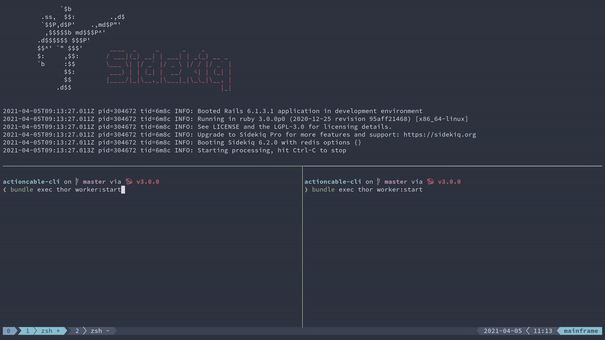

# Actioncable CLI

This project demonstrates how to create a real-time command line application using ActionCable and Thor.

You can find out more in [this post](https://hschne.at/2021/04/04/build-real-time-clis-with-actioncable.html)
